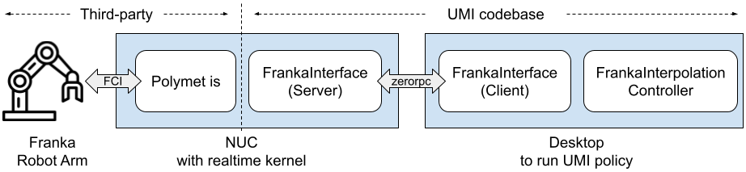

# Deploy UMI Policy on Franka Robot

## System Overview

* FrankaInterface (Server): [scripts_real/launch_franka_interface_server.py](scripts_real/launch_franka_interface_server.py) (L7)

* FrankaInterface (Client): [umi/real_world/franka_interpolation_controller.py](umi/real_world/franka_interpolation_controller.py) (L36)

* FrankaInterpolationController: [umi/real_world/franka_interpolation_controller.py](umi/real_world/franka_interpolation_controller.py) (L71)

## Instructions
* Follow the [documentation](https://facebookresearch.github.io/fairo/polymetis/prereq.html#franka-panda-hardware-setup) to install *Polymetis* on a computer with realtime kernel (i.e., NUC in our example).
* Launch FrankaInterface Server on NUC.
    
    `python scripts_real/launch_franka_interface_server.py`
* (optional) Now you should be able to control the Franka arm using a space mouse on another desktop, the one you are going to run the robot policy on.

    `python scripts_real/control_franka.py`
* Change [eval_robots_config.yaml](example/eval_robots_config.yaml)/robots/robot_type to `'franka'`. This will change the robot controller in [umi_env](umi/real_world/bimanual_umi_env.py) (L233).

* Obtain IP address and update [eval_robots_config.yaml](example/eval_robots_config.yaml)/robots/robot_ip.
* On the Franka interface website
    * Set mass to 1.8 kg
    * Set Flange to Center of Mass of Load Vector to (0.064, -0.06, 0.03)m.

* Then you should be able to launch the evaluation on the franka arm.

    `python eval_real.py --robot_config=example/eval_robots_config.yaml -i cup_wild_vit_l.ckpt -o data/eval_cup_wild_example`